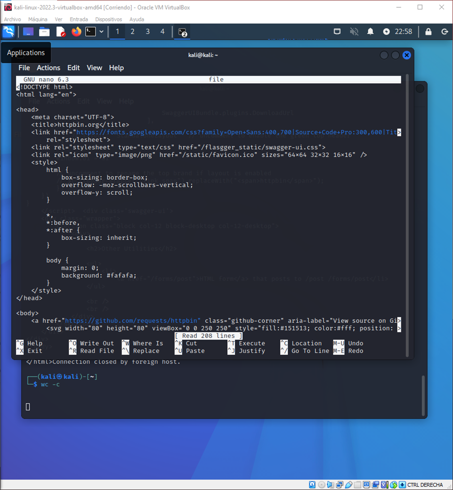
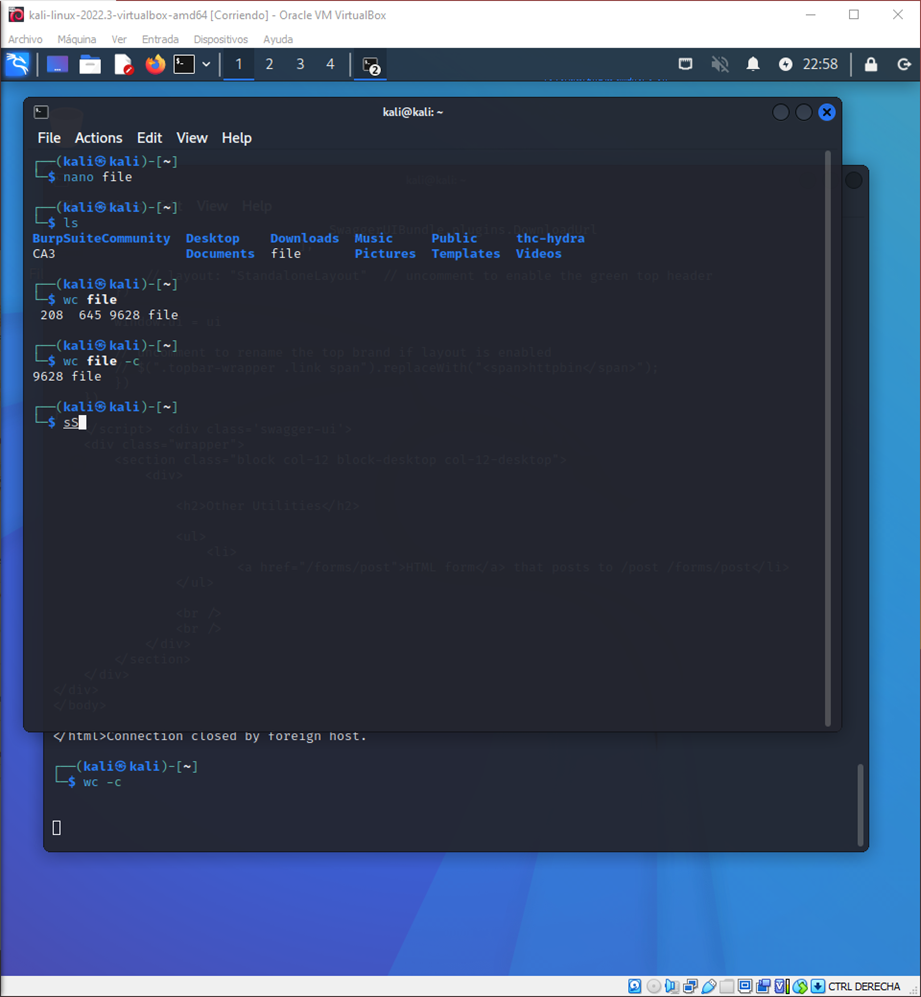
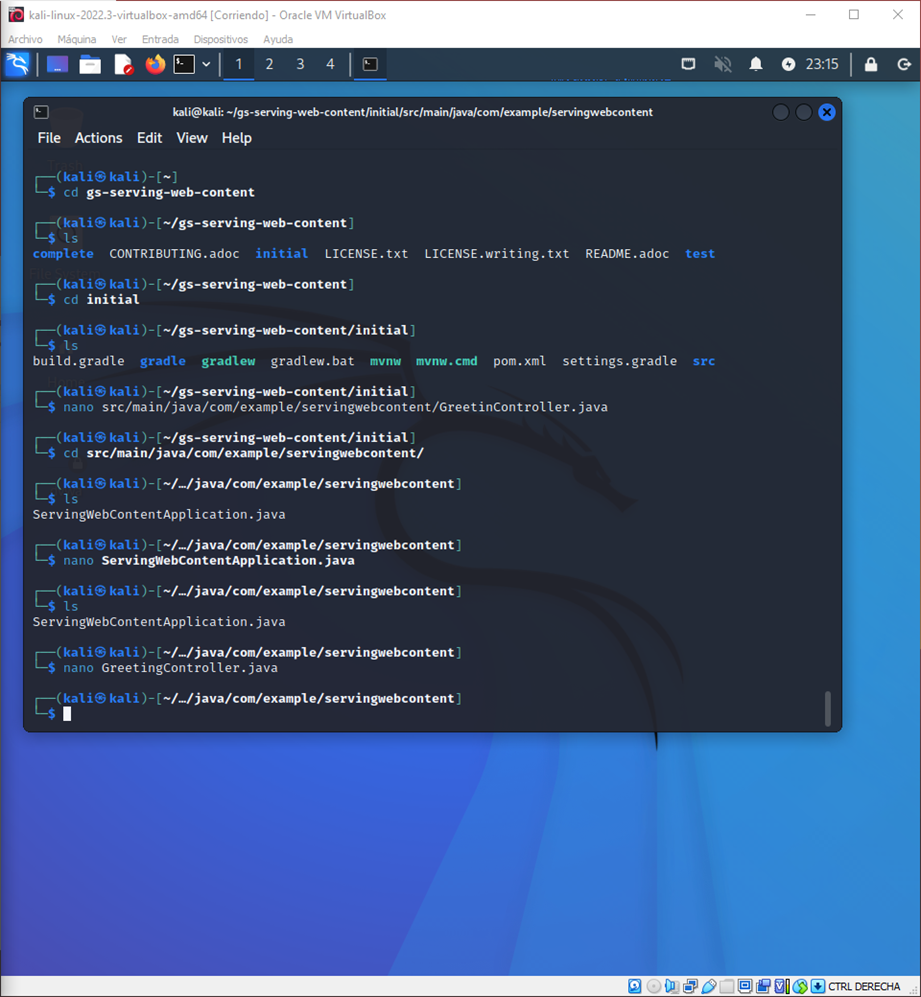
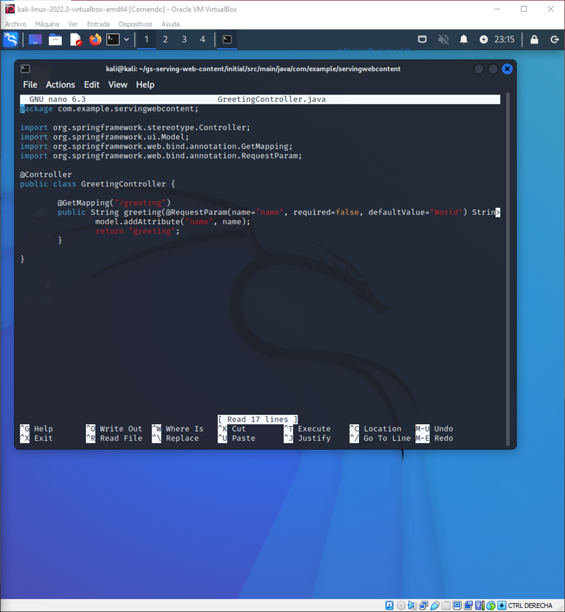
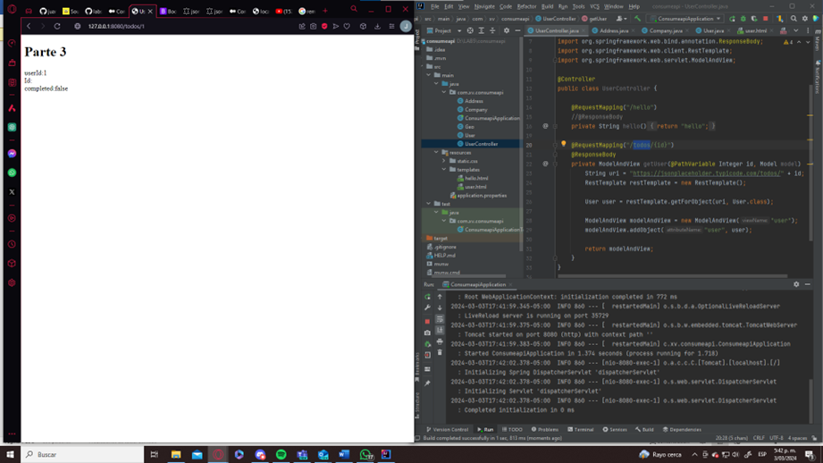
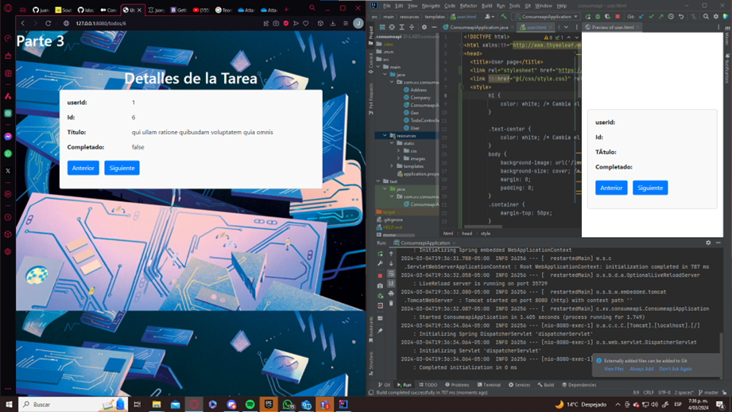

# LABORATORIO 5 - SPRING MVC INTRODUCTION

## Tecnologías Utilizadas

- Java
- Spring Boot
- Thymeleaf
- Bootstrap

### PARTE I. - JUGANDO A SER UN CLIENTE HTTP
Usaremos las siguientes aplicaciones como cliente HTTP
- Postman
- Telnet

  Aquí está la solicitud GET con el recurso ssss/abc.html agregado:

vbnet
Copy code
GET /ssss/abc.html HTTP/1.0
Host: www.escuelaing.edu.co
Este comando se debe pegar en la consola del servidor ya abierta. Luego de pegar estas líneas, asegúrate de presionar ENTER dos veces para enviar la solicitud HTTP.

El resultado obtenido incluye el código de estado HTTP 301, que indica un redireccionamiento permanente. El servidor respondió con el siguiente encabezado:

HTTP/1.1 301 Moved Permanently
Estos códigos de error se manejan según las circunstancias específicas y se pueden mostrar al usuario para indicar problemas con la solicitud o el servidor. En el caso de los códigos de error 404 y 500, por ejemplo, pueden requerir intervención del administrador del servidor para solucionar los problemas subyacentes.

Los comandos curl -v y curl -i son útiles para realizar solicitudes HTTP con la herramienta curl y mostrar información adicional sobre la respuesta del servidor. Aquí te explico las diferencias entre ambos:

curl -v www.httpbin.org: Este comando realiza una solicitud HTTP GET a www.httpbin.org y muestra información detallada de la transacción. La opción -v (o --verbose) activa el modo detallado o verbose, que muestra la secuencia completa de la solicitud y la respuesta, incluyendo encabezados de solicitud y respuesta, así como cualquier redireccionamiento que ocurra. Este modo verbose es útil para depurar problemas de conexión y para obtener una comprensión más detallada de cómo interactúa curl con el servidor.

curl -i www.httpbin.org: Este comando realiza una solicitud HTTP GET a www.httpbin.org y muestra los encabezados de respuesta del servidor en la salida. La opción -i (o --include) indica a curl que incluya los encabezados de respuesta en la salida junto con el cuerpo de la respuesta. Esto puede ser útil para inspeccionar los encabezados de respuesta, como los códigos de estado HTTP, los encabezados de contenido y otros metadatos, sin tener que analizar manualmente la respuesta completa.

¿Qué pasa si no envío el método correcto?

Si no envías el método HTTP correcto (por ejemplo, envías un POST en lugar de un GET), es posible que recibas un código de estado HTTP 405 (Método no permitido) o 400 (Solicitud incorrecta) dependiendo de cómo esté configurado el servidor. En general, el servidor esperará un tipo específico de solicitud y, si no coincide, responderá con un error.
¿Qué pasa si al body response HTML lo fuerzo a leerse como JSON?

Si fuerzas a leer el body de respuesta HTML como JSON, es probable que obtengas un error de análisis ya que el contenido del body no estará en el formato JSON esperado. El navegador web puede interpretar HTML correctamente, pero un parser de JSON no entenderá la estructura del HTML.
¿Por qué el preview de HTML no se ve igual a cuando accedo a la URL en un navegador web?

El preview de HTML en Postman puede no verse exactamente igual que en un navegador web debido a que Postman no procesa y renderiza HTML de la misma manera que un navegador. Postman muestra el HTML en bruto, lo que significa que no aplica estilos CSS ni ejecuta scripts JavaScript, mientras que un navegador web sí lo hace.
¿Qué pasa si le envías un body a una solicitud GET?

Según la especificación de HTTP, las solicitudes GET no deben contener un body. En la práctica, la mayoría de los servidores ignorarán cualquier body enviado en una solicitud GET. Sin embargo, algunos servidores pueden responder con un error o simplemente ignorar el body. En general, es mejor evitar enviar bodies en solicitudes GET y utilizar métodos como POST para enviar datos al servidor.

### PARTE III. - HACIENDO UNA APLICACIÓN WEB DINÁMICA USANDO EL PATRÓN MVC
Usaremos la documentación oficial de Spring  

1. **¿Por qué MVC obtiene ese nombre?**
    - MVC significa Modelo-Vista-Controlador. Este patrón de diseño se denomina así porque divide una aplicación en tres componentes principales:
        - Modelo: Representa los datos y la lógica de negocio de la aplicación.
        - Vista: Es la interfaz de usuario que presenta los datos al usuario y recibe la entrada del usuario.
        - Controlador: Gestiona las solicitudes del usuario, procesa la entrada, interactúa con el modelo y selecciona la vista adecuada para mostrar los resultados al usuario. Este componente actúa como intermediario entre el modelo y la vista.

2. **¿Cuáles son las ventajas de usar MVC?**
    - Algunas ventajas de usar el patrón MVC son:
        - Separación de responsabilidades: Permite separar la lógica de negocio, la presentación de datos y el manejo de solicitudes en componentes independientes, lo que facilita la modularidad y el mantenimiento del código.
        - Reutilización de código: Al dividir la aplicación en componentes independientes, es más fácil reutilizar el código en diferentes partes de la aplicación.
        - Facilidad para realizar pruebas: La separación de responsabilidades facilita la realización de pruebas unitarias y de integración en cada componente por separado.
        - Escalabilidad: Permite escalar la aplicación de manera más eficiente, ya que los componentes pueden modificarse o reemplazarse sin afectar a otros componentes.

3. **¿Qué diferencia tiene la estructura de directorios de este proyecto comparado con las de proyectos pasados (con solo Maven y Java EE)?**
    - La estructura de directorios en un proyecto Spring MVC generalmente sigue una convención específica, donde se separan los recursos estáticos (como HTML, CSS, JavaScript) en un directorio específico (por ejemplo, `resources/static`) y las plantillas de vistas Thymeleaf o JSP en otro directorio (por ejemplo, `resources/templates`). En comparación, los proyectos solo con Maven y Java EE pueden tener una estructura más simple sin esta separación específica para recursos estáticos y vistas.

4. **¿Qué anotaciones usaste y cuál es la diferencia entre ellas?**
    - En el proyecto Spring MVC, se usan anotaciones como `@Controller`, `@RequestMapping`, `@GetMapping`, `@PostMapping`, etc. Estas anotaciones se utilizan para configurar el controlador y mapear las solicitudes HTTP a métodos específicos en el controlador. La diferencia entre ellas radica en el tipo de solicitud HTTP que manejan (`@GetMapping` para GET y `@PostMapping` para POST) y en la URL que especifican para acceder al método del controlador.

5. **Ahora, haz el request GET http://localhost:8080/greeting usando Postman, y revisa si el body de la respuesta es igual a alguno de los archivos del proyecto. ¿Significa eso que es un recurso web dinámico o estático?**
    - Si el body de la respuesta es igual a alguno de los archivos del proyecto, significa que es un recurso web estático. En este caso, el controlador probablemente esté devolviendo un archivo estático (por ejemplo, HTML, CSS o JavaScript) que se encuentra en el directorio de recursos estáticos del proyecto. Un recurso web dinámico sería aquel cuyo contenido se genera dinámicamente en el servidor, como una página HTML generada por un controlador de Spring MVC con datos específicos.

### PARTE V. - APLICACIÓN Juego de Adivinar Número

Este es un juego simple en línea donde los jugadores intentan adivinar un número generado aleatoriamente entre 1 y 10 para ganar un premio. Cada intento fallido reduce el premio en $10,000 hasta llegar a un saldo negativo.

## Características

- Generación aleatoria de un número entre 1 y 10 en cada intento.
- Actualización dinámica del premio según los intentos del jugador.
- Reinicio del juego con un botón de reset.

## Instalación y Uso

1. Clona este repositorio en tu máquina local.
2. Abre el proyecto en tu IDE de Java preferido.
3. Ejecuta la aplicación desde tu IDE o mediante el comando `mvn spring-boot:run`.
4. Abre un navegador web y navega a `http://localhost:8080/guess` para iniciar el juego.
5. Ingresa un número entre 1 y 10 y presiona el botón "Adivinar".
6. Observa el mensaje de victoria o derrota y el premio actual.
7. Puedes reiniciar el juego en cualquier momento haciendo clic en el botón "Reiniciar juego".

