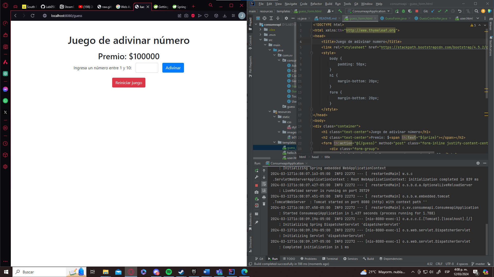

# LABORATORIO 6 - SPRING MVC Game

### PARTE II. - APLICACIÓN Juego de Adivinar Número

Este es un juego simple en línea donde los jugadores intentan adivinar un número generado aleatoriamente entre 1 y 10 para ganar un premio. Cada intento fallido reduce el premio en $10,000 hasta llegar a un saldo negativo.

## Características

- Generación aleatoria de un número entre 1 y 10 en cada intento.
- Actualización dinámica del premio según los intentos del jugador.
- Reinicio del juego con un botón de reset.

## Instalación y Uso

1. Clona este repositorio en tu máquina local.
2. Abre el proyecto en tu IDE de Java preferido.
3. Ejecuta la aplicación desde tu IDE o mediante el comando `mvn spring-boot:run`.
4. Abre un navegador web y navega a `http://localhost:8080/guess` para iniciar el juego.
5. Ingresa un número entre 1 y 10 y presiona el botón "Adivinar".
6. Observa el mensaje de victoria o derrota y el premio actual.
7. Puedes reiniciar el juego en cualquier momento haciendo clic en el botón "Reiniciar juego".

